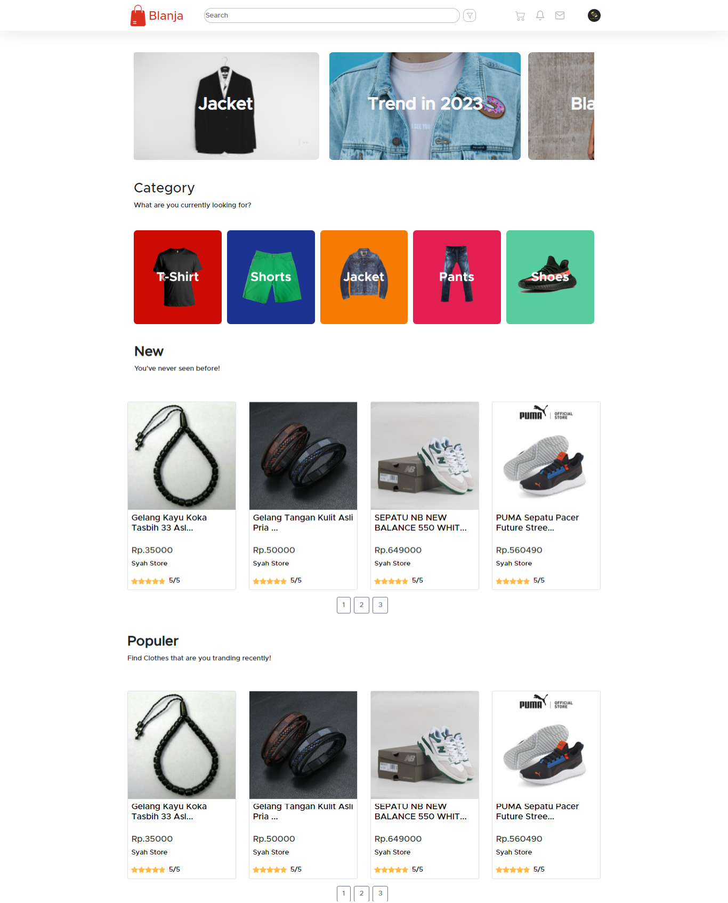
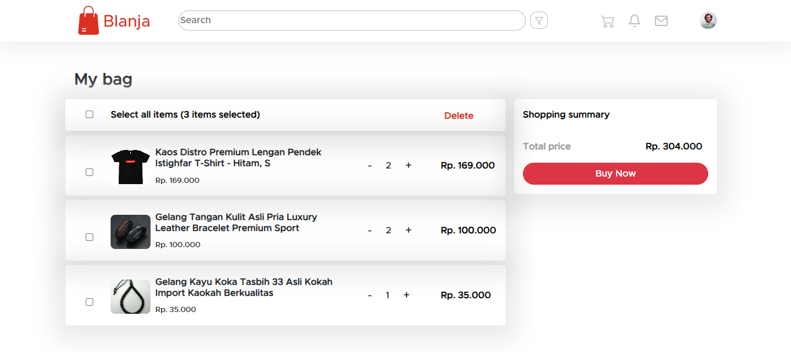
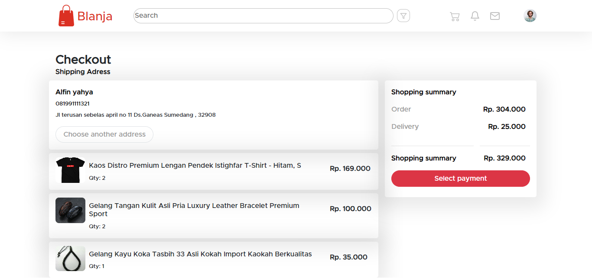
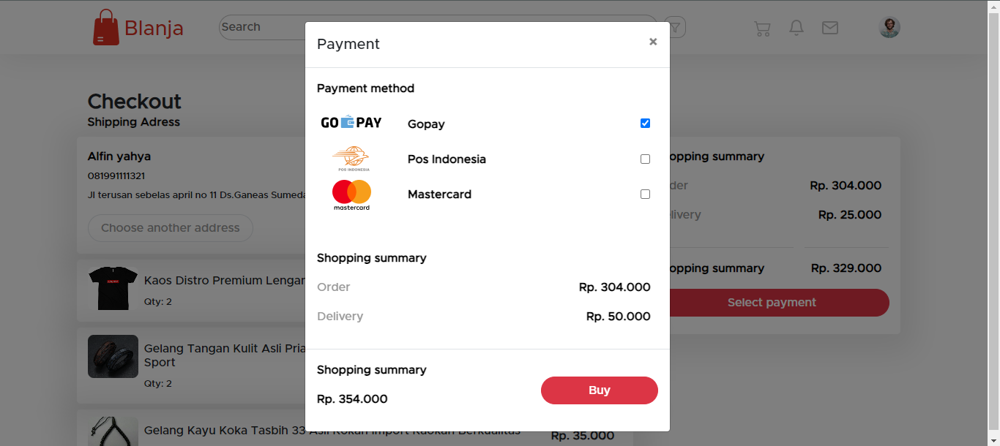
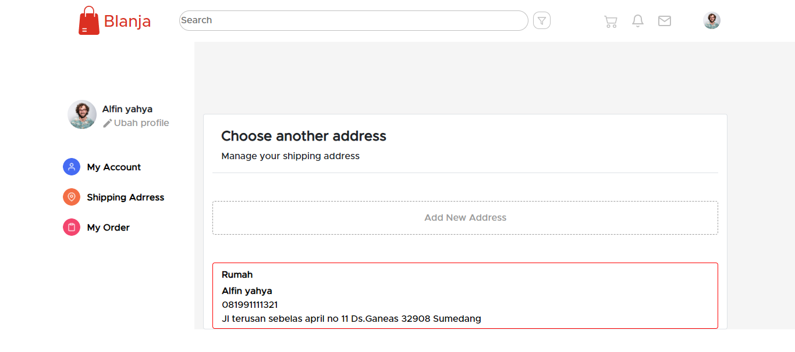

<br />
<p align="center">
  <div align="center">
    
  </div>
  <h3 align="center">Blanja</h3>
  <p align="center">
    <a href="https://github.com/flyinvyn/be-Blanja"><strong>Explore the docs »</strong></a>
    <br />
    <a href="https://fe-blanja.vercel.app/">View Demo</a>
    ·
    <a href="https://be-blanja-pi.vercel.app/">Api Demo</a>
  </p>
</p>

## Table of Contents

- [Table of Contents](#table-of-contents)
- [About The Project](#about-the-project)
  - [Built With](#built-with)
- [Getting Started](#getting-started)
  - [Prerequisites](#prerequisites)
  - [Installation](#installation)
  - [Setup .env](#setup-env)
- [Screenshots](#screenshots)
- [Contributing](#contributing)
- [Related Project](#related-project)
- [Contact](#contact)

<!-- ABOUT THE PROJECT -->

## About The Project

An e-commerce application is a digital platform that allows users to carry out various trading activities online. Here is a general description of an e-commerce application:

App Name: Blanja

Description:
Blanja is an innovative and practical e-commerce application that allows users to explore, buy, and sell various products and services online. With Blanja, you can enjoy a convenient and safe shopping experience from the comfort of your home or anywhere via your mobile device.

Blanja is the best solution for all your shopping needs. Enjoy the convenience of online shopping, find quality products, and sell your items with ease!

<!-- GETTING STARTED -->

## Getting Started

### Prerequisites

This is an example of how to list things you need to use the software and how to install them.

- [NodeJs](https://nodejs.org/en/download/)
- [Bootstrap](https://getbootstrap.com/)
- [ReactJS](https://reactjs.org/)
- [Redux](https://redux.js.org/)

### Installation

- Clone This Front End Repo

```
git clone https://github.com/flyinvyn/fe-Blanja
```

- Go To Folder Repo

```
cd fe-Blanja
```

- Install Module

```
npm install / npm i
```

- <a href="#setup-env">Setup .env</a>
- Type ` npm start` To Start Website

### Setup .env

Create .env file in your root project folder.

```
REACT_APP_BASEURL = [API_URL]
```

## Screenshots

<table>
 <tr>
    <td></td>
    <td> </td>
  </tr>
   <tr>
    <td>Register as Customer</td>
    <td>Register as Seller</td>
  </tr>

 <tr>
    <td></td>
    <td> </td>
  </tr>
   <tr>
    <td>Login as Customer</td>
    <td>Login as Seller</td>
  </tr>

 <tr>
    <td></td>
    <td> </td>
  </tr>
   <tr>
    <td>Home page</td>
    <td>Detail page</td>
  </tr>

 <tr>
    <td></td>
    <td> </td>
  </tr>
   <tr>
    <td>Order page</td>
    <td>Checkout page</td>
  </tr>

 <tr>
    <td></td>
    <td> </td>
  </tr>
   <tr>
    <td>Select Address</td>
    <td>Payment</td>
  </tr>

 <tr>
    <td></td>
    <td> </td>
  </tr>
   <tr>
    <td>Profile customer</td>
    <td>Create address</td>
  </tr>

 <tr>
    <td></td>
    <td> </td>
  </tr>
   <tr>
    <td>Shipping address</td>
    <td>Profile seller</td>
  </tr>

 <tr>
    <td></td>
    <td> </td>
  </tr>
   <tr>
    <td>Product seller</td>
    <td>Selling product</td>
  </tr>

</table>

<!-- CONTRIBUTING -->

## Contributing

Contributions are what make the open source community such an amazing place to be learn, inspire, and create. Any contributions you make are **greatly appreciated**.

1. Fork the Project
2. Create your Feature Branch (`git checkout -b feature/AmazingFeature`)
3. Commit your Changes (`git commit -m 'Add some AmazingFeature'`)
4. Push to the Branch (`git push origin feature/AmazingFeature`)
5. Open a Pull Request

## Related Project

:rocket: [`Backend`](https://github.com/flyinvyn/be-Blanja)

:rocket: [`Frontend`](https://github.com/flyinvyn/fe-Blanja)

:rocket: [`Demo`](https://fe-blanja.vercel.app/)

Project Link: [https://github.com/flyinvyn/fe-Blanja](https://github.com/flyinvyn/fe-Blanja)
